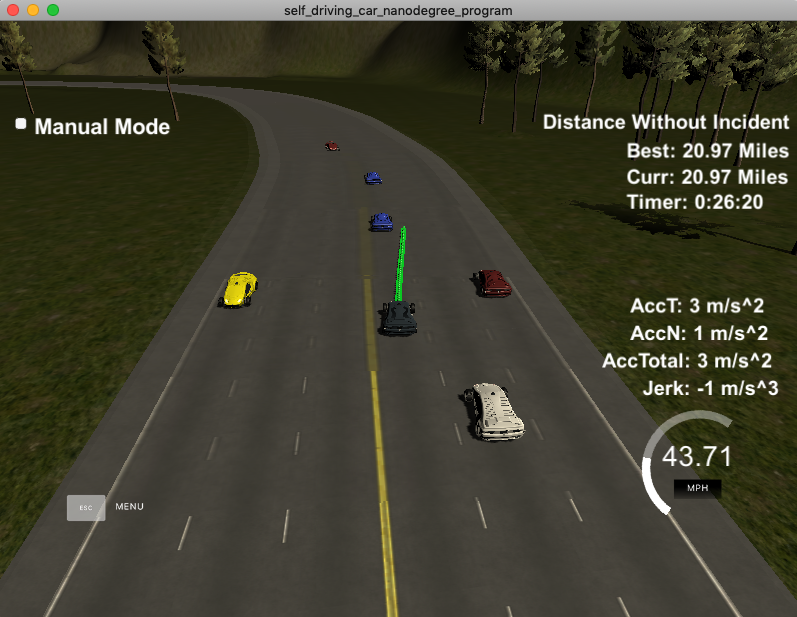

# Model Documentation

I've made a *PathPlanner* class to handle the car.
When new telemetry is received, is sent to an object of this class using 'newTelemetry' and the class updates its properties next_x_vals, next_y_vals which are copied to the message sent through the web socket.

The model is mainly based on the code of the walktrouth. Most of the walkthrough code is inside the method *planPath* with receives an Action struct with destination lane and velocity. *planPath* calculates the x,y points to achieve those lane and velocity.

The method *getBestAction* tries to find the best action that is going to be sent to *planPath*. The steps are the following:

1. Calculate the maximum speed for each lane based on the present cars. If there are no cars, then the maximum speed is 49.5MPH
2. Find the maximum speed lane index and maximum speed of that lane. This lane is going to be the target lane.
3. If the center lane has the same maximum speed, then the center lane is the target lane. The center lane offers more flexibility changing lanes.
4. If maximum speed lane is not the current lane, calculate next_lane as the countiguous lane towards the maximum speed lane.
5. Look for cars in the next_lane. If there are close, either in front of or behind of the car, then there won't be a lane change.
6. If there is a car in the current lane that is too close, the lower the speed, else increase it until it reaches the maximum speed.

Screenshot of the car driving more than 20 miles without incident:

# Files

* path_planner.h
* path_planner.cpp
* vehicle.h
* vehicle.cpp
* action.h

# Reflection

There are many points of improvements:
* Target velocity: instead of using spline, probably a quantic polynomial, setting  final position, velocity and acceleration will help avoid "bouncing" behind slow cars.
* Finding fastest lane: using a more advanced cost funcion the chosen lane could provide a faster travel plan. Right now, cars that are far away mark to the top speed of the lane and the car changes lane too soon, sometimes making it imposible to take advantage of spaces between cars that are in front.
* State machine: using a state machine can help to simplify better strategies, for instance, using the prepare to change lane state to better find a space between cars to execute the change of lane.
* Colission avoidance: right now other cars position is used to infer if they are going to change lanes. A lateral/d speed + position analisis would could better prediction that could prevent risk maneuvers from executing. Speed of cars in other lanes is not taking into account and using them less risk trayectories with smaller security distances could be achieved.